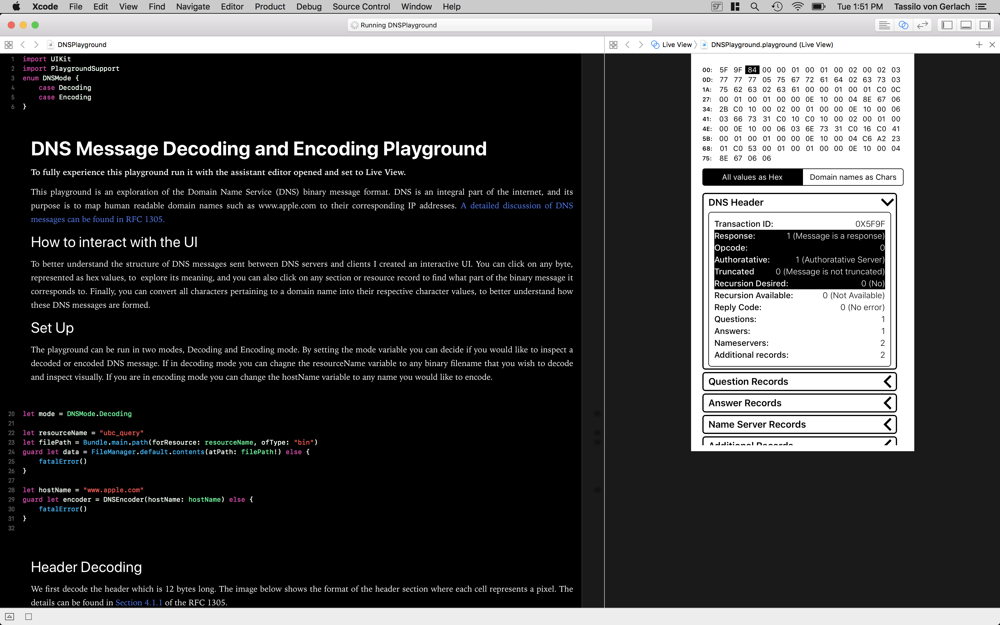

# WWDC 2018 Scholarship Submission [Accepted]

The focus of my playground is to explore of how we can leverage the powers of Swift to decode Domain Name Service (DNS) binary messages.

To create an interactive experience, I paired the decoding of the message, with an interactive UI to explore the structure of DNS messages. The table at the top of the view represents the DNS message, with each cell representing a single byte as a hex number. The user can click on either one of these cells to visually see what information that particular byte represents, or on any of the header or record sections to see where in the message it is encoded. The user can also choose to represent all domain names using their character representation using the segment control under the hex table, to better visualize how names are encoded in the message.

